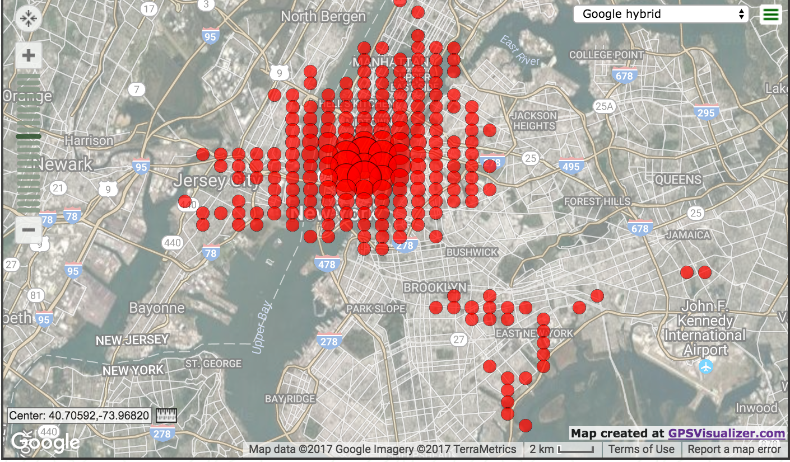
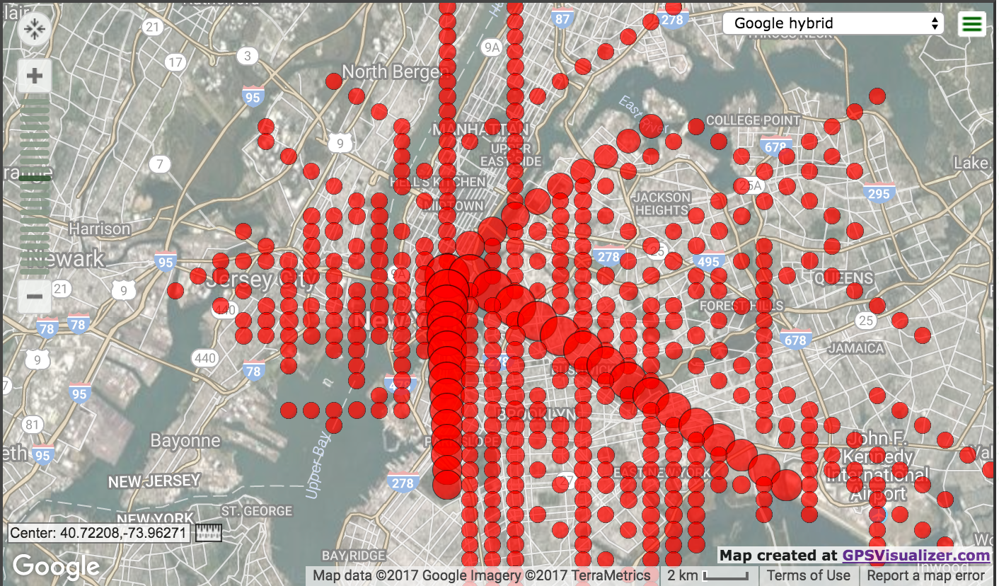

Deep_Learning
==============================

Maximize revenue of NYC taxicabs with deep reinforcement learning (DQN) and Actor Critic (AC) algorithms.
This project was inspired by http://cs229.stanford.edu/proj2014/Jingshu%20Wang,%20Benjamin%20Lampert,%20Improving%20Taxi%20Revenue%20With%20Reinforcement%20Learning.pdf

**Start**: Notebooks -> *NYC_Maximize_Taxi_Cab_Fare_With_Reinforcement_Learning*. This is an overview of the project.

**Results**: Found that an Actor-Critic deep reinforcement learning implementation could earn on average **10-12%** more per day than a naive implementation. You can view the search space of a naive implementation against this actor-critic implementation below where the larger circles represent more frequently visited states.

# Path taken by naive (random) algorithm

# Path taken by actor-critic algorithm

- Notice the structure present in the actor-critic algorithm.

Project Organization
------------

    ├── LICENSE
    ├── README.md          <- The top-level README for developers using this project.
    ├── data               <- Not available on GitHub. Can access here http://www.nyc.gov/html/tlc/html/about/trip_record_data.shtml
    │  
    │
    │
    ├── notebooks          <- Jupyter notebook containing an overview of the entire project named
    |   |                     NYC_Maximize_Taxi_Cab_Fare_With_Reinforcement_Learning. In addition,
    |   |                     the trained weights, and loss, from each model are located here.
    |   |                     Also, the .shape files for the NYC map are located here.
    │   ├── actor_critic_mlp <- Weights for Actor Critic Model + loss during training
    │   ├── lstm_model_dqn <- Weights for the LSTM DQN model + loss during training
    │   └── mlp_model_dqn  <- Weights for MLP DQN model and loss during training
    │   └── algorithm_comparisons.py <- Python file that tracks each algorithm implemented from the same starting location. Returns the latitude and longitude of each algorithm after picking a move to make.
    ├── references         <- Data dictionaries, manuals, and all other explanatory materials.
    │
    ├── figures            <- Generated graphics of each algorithms', and a naive approach's,
    |                         performance in NYC over time. Also contains the loss functions over training epochs.
    │
    ├── requirements.txt   <- The requirements file for reproducing the analysis environment, e.g.
    │                         generated with `pip freeze > requirements.txt`
    │
    ├── src                <- Source code for use in this project. Includes code for the models to
    |   |                     build with DQN and Actor Critic, hyperparameter selection (hyperas), and
    |   |                     visualizations.
    │   │
    │   ├── data           <- Scripts to download or generate data
    │   │   └── make_dataset.py   <- Uses a preprocessed .csv file to load into memory with auxiliary function (below)
    |   |   |__ auxiliary_functions.py <- functions to compute geohashes from latitudes. General data cleaning scripts
    │   │
    │   │
    │   ├── models-DQN         <- Scripts to train models and then use trained models to make
    │   │   │                 predictions. Also, includes training data. For the DQN algorithm.
    │   │   ├── predict_model.py
    │   │   └── model_mlp.py   <- Train/Test the DQN MLP algorithm
    |   |   └── model_lstm.py   <- Train/Test the DQN LSTM algorithm
    |   |   └── hyperparameter_optimization_mlp.py <- hyperparameter selection for the MLP model for our RL algorithm
    |   |   └── hyperparameter_optimization_lstm.py <- hyperparameter selection for the LSTM model
    │   ├── models-Actor-Critic <- Script that shows the .py file with the training procedure
    │   └── visualization  <- Scripts to create exploratory and results oriented visualizations. Additional images showing the loss and fares earned over time.
    │       └── plotting_geohashes.py   <- A script to see a heatmap of fares over time for January for NYC taxis
    │
    └── tox.ini            <- tox file with settings for running tox; see tox.testrun.org
    └── Deep_Learning      <- PowerPoint used to present the results.

--------

<small>Project based on the <a target="_blank" href="https://drivendata.github.io/cookiecutter-data-science/">cookiecutter data science project template</a>. #cookiecutterdatascience</small>

